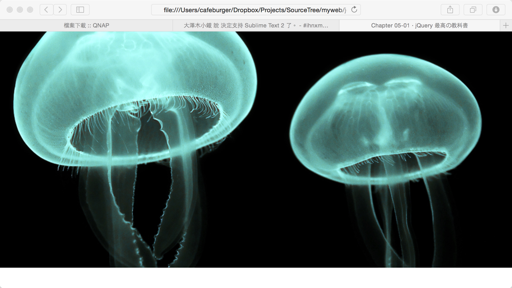
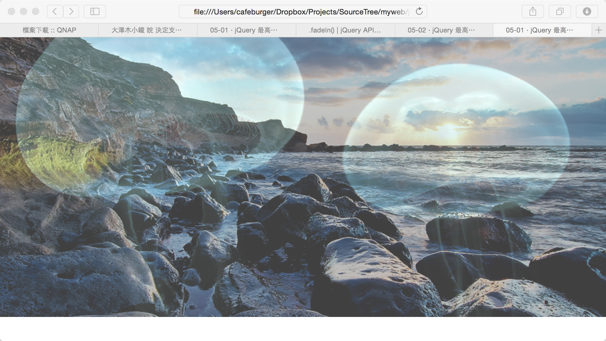
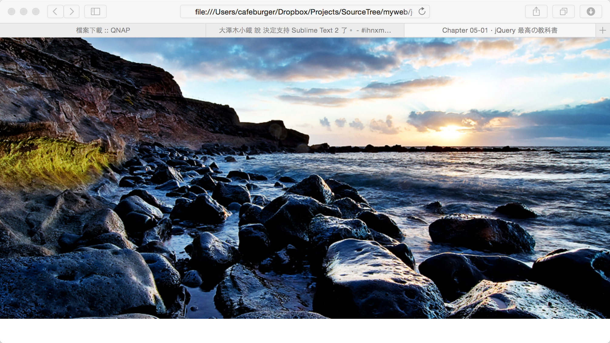

#幻燈片展示(自動)

@(104-1.網站程式設計)[jquery_sample]

---

###效果

每隔一段時間,圖片會自動切換到下一張

切換中...




###HTML程式碼

```html
<!DOCTYPE html>
<html class="no-js" lang="zh">  <!-- (補充2) -->
<head>
<meta charset="UTF-8">
<meta http-equiv="X-UA-Compatible" content="IE=edge">
<title>Chapter 05-01 &#xB7; jQuery 最高の教科書</title>
<link rel="stylesheet" href="./css/normalize.css">
<link rel="stylesheet" href="./css/main.css">
<script src="./js/vendor/modernizr.custom.min.js"></script>  <!-- (補充1) -->
<script src="./js/vendor/jquery-1.10.2.min.js"></script>
<script src="./js/main.js"></script>
</head>
<body>
<header class="hero-header">
    <div class="inner">
        <div class="slideshow">
            
            
            
            
        </div>
    </div>
</header>
</body>
</html>
```

說明： 

1. 將數張圖片用一個`<div>`包覆,並設定class為`slideshow`會以css套用其效果

###CSS主要部份

```css
.slideshow {
    overflow: hidden;
    position: relative;
    min-width: 960px;
    height: 465px;
}
.slideshow img {
    /*(1)*/
    display: none;
    position: absolute;
    /*(2)*/
    left: 50%;
    margin-left: -800px;
}

/* JavsScript 無効時,見補充3 */
.no-js .slideshow img:first-child {
    display: inline;
}

```

1. 這裡將所有圖片預設都不顯示(`display:none;`),並將其以絕對位置方式(`position:none;`),會讓每張圖都重疊

2. 由於這裡每張圖片寬度都是1600px,如果瀏覽器的寬度不足1600px時,右邊會被切掉!如果要做到圖片二邊等寬裁切(也就是圖片保持水平置中),可以先以`margin-left: -800px`水平向左平移圖片一半的寬度,再以`left:50%`,向右移50%(這裡是指瀏覽器寬度的50%)!

###javascript 部份

```javascript
$(function () {

    /*
     * Slideshow
     */
    // 對每個有slideshow類別的元素進行處理(1)
    $('.slideshow').each(function () {

        var $slides = $(this).find('img'), // 所有Slide(2)
            slideCount = $slides.length,   // Slide個數
            currentIndex = 0;              // 目前Slide的index(3)
        // 淡入顯示首張Slide
        $slides.eq(currentIndex).fadeIn(); // (4)

        // 每7500毫秒就執行showNextSlide函數
        setInterval(showNextSlide, 7500);   // (9)

          // 顯示下一張Slide的函數(5)
        function showNextSlide () {

                        //下張Slide的index
                        //(如果是最後一張Slide，則會到第一張)
            var nextIndex = (currentIndex + 1) % slideCount; // (6)

            // 目前的Slide淡出顯示
            $slides.eq(currentIndex).fadeOut(1000); // (7)

            // 下一張Slide淡入顯示
            $slides.eq(nextIndex).fadeIn(1000); // (8)

               // 更新目前的index
            currentIndex = nextIndex;
        }

    });

});

```

1. 在這範例中如果有多個`slideshow`class,則`each()`會對所有的class均執行一次
2. `$slides`裡會有所有圖片的物件
3. `currentIndex`會紀錄目前所顯示的圖片索引
4. `$slides.eq(currentIndex)`會指定第`currentIndex`個物件(圖片),也可以寫成`$($slides[currentIndex])`
5. 宣告一個"顯示下一張圖片"的函式
6. 取得下一張圖的索引值(注意取餘數的作用)
7. 將原圖淡出(`fadeOut()`)
8. 下張圖淡入(`fadeIn()`)
9. 利用`setInterval()`來固定一段時間執行(5)函式

###補充說明
瀏覽器是可以將javascript的運作關閉(不過應該很少使用者會這麼做),一但關閉後,為了要讓這個網頁維持最基本的運作,我們要將幻燈片中的第一張圖顯示出來!

1. 首先,要加入`modernizr.js`程式庫
2. `<html class="no-js" lang="ja">`在這裡的`no-js`class,會被`modernizr`試著轉換成`js`,由於轉換過程是以javascript來轉換,因此,如果轉換失敗則代表javascript的運作被關閉了!同時這裡的`no-js`依然維持不變
3. 這裡的css會依`no-js`class來設定第一張幻燈片,將其設定為"顯示"狀態,如此就算javascript的功能失效,依然還是看的到第一張圖!

    